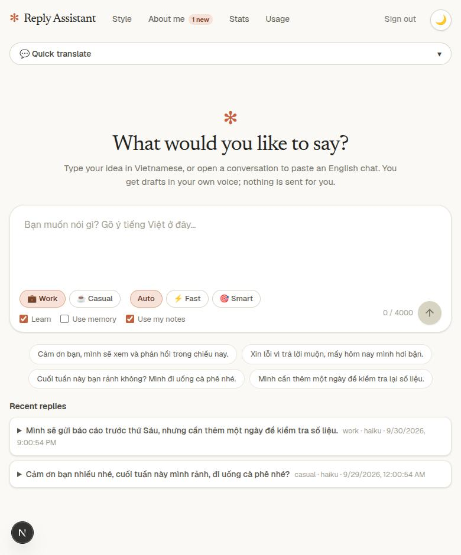
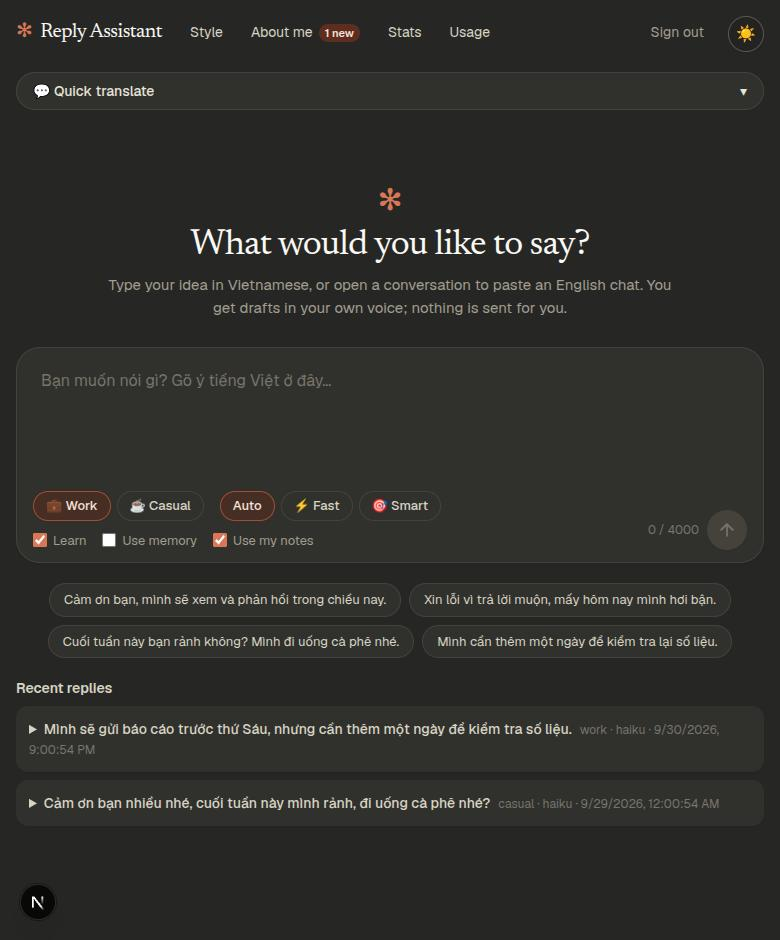
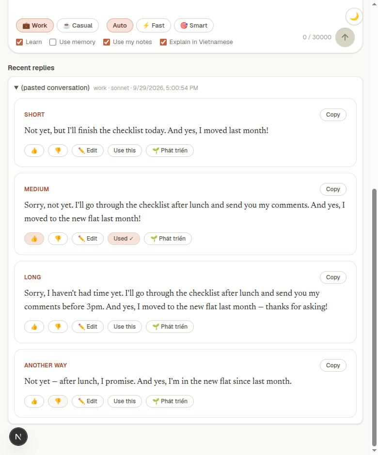
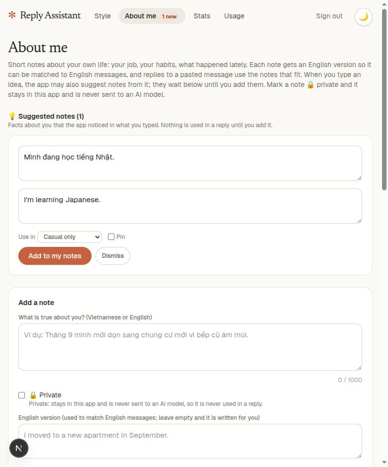
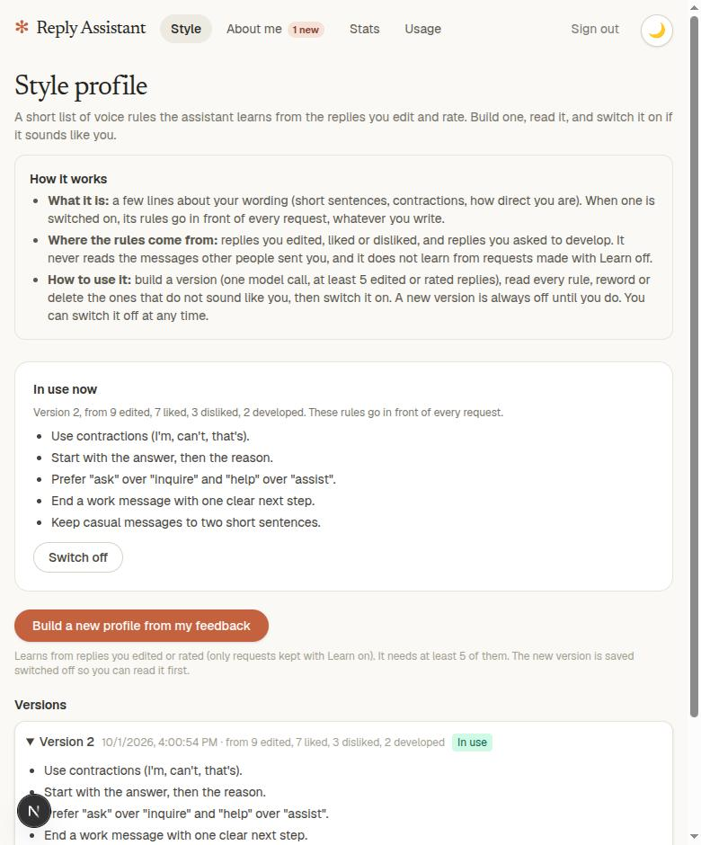

# 💬 Reply Assistant

**A personal writing assistant that drafts English replies in _your_ voice, from a Vietnamese idea or a pasted chat. It learns how you write, remembers facts about you, and never sends anything on its own.**

Type what you want to say in Vietnamese, or paste an English conversation, and get a few short drafts at an everyday (B1) level. You pick one, edit it, copy it. The app learns from what you pick, rate and change, and uses short notes about your own life so a reply can mention the right detail, without ever inventing one.

It is a single-user app, built end to end as a showcase of practical LLM engineering: streaming, prompt caching, retrieval, privacy by construction, cost control and honest testing.

<p align="center">
  
  
</p>

> The screenshots use made-up demo data (`npm run seed:demo`). The look is a warm, paper-like theme with one terracotta accent, a serif for what the assistant writes, and a light and a dark mode.

## What it does

| | |
|---|---|
| **Two ways in** | Type an idea in Vietnamese (**quick translate**), or paste an English chat into a **conversation thread**. Pasting again merges new lines and skips the ones already there. |
| **Four drafts, streamed** | Short, medium, long and "another way". They appear token by token. Rate 👍/👎, edit, or **Use this** (copy and mark as sent). |
| **🌱 Develop** | Grow one draft in a direction you choose ("add that I moved last month", "ask them something back", "more casual") into two longer versions. The detail comes from you or from a saved note, never from the model. |
| **Explain in Vietnamese** | For a pasted message: a Vietnamese translation plus notes on tone and idioms, produced in parallel so replies are not slowed down. |
| **Memory** | Your past liked and edited replies are retrieved by meaning (pgvector) and offered to the model as examples. |
| **Style profile** | A short list of voice rules built from your edits and ratings. A new version is saved _off_; you read it, reword or delete rules, then switch it on. |
| **🧑 About me notes** | Facts and dated events about you, scoped to work or casual, pinned or private, each with an English version. A pasted message gets the notes that fit; the reply says which notes it used, with a switch to redo it without one. |
| **💡 Suggested notes** | After a reply, the app proposes up to three facts from what _you typed_. They wait in an inbox until you approve them. |
| **Honest accounting** | Every model and embedding call is recorded. A usage page shows spend by day, kind and conversation, and a daily budget refuses requests when it is reached. |
| **Your data stays yours** | Passcode login, JSONL export of your replies, JSON export of your notes (private notes never included), delete for threads and a delete-all for notes. |

<p align="center">
  
  
  
</p>

## How a request flows

```mermaid
flowchart LR
  A[Vietnamese idea or pasted chat] --> B[Plan: which notes could apply?]
  B --> C[One embedding request<br/>memory + notes]
  C --> D[Choose notes and examples]
  D --> E[Build prompt<br/>cached prefix + per-request message]
  E --> F[Haiku or Sonnet<br/>streamed as NDJSON]
  F --> G[Parse options as they arrive]
  G --> H[Save, then send done event]
  H -.after the response.-> I[Index for memory · summarise thread · propose notes]
```



- **Routing.** Short typed ideas go to the fast model. Long threads, big pastes and any reply that carries notes about you go to the careful one (an explicit choice always wins).
- **Prompt caching.** The style guide, the active style profile and your pinned notes form a byte-stable prefix that is cached. Everything that changes per request goes in the user message.
- **Fail-open everywhere.** If embeddings, the summary or the explanation fail, the replies still arrive.

More in [docs/ARCHITECTURE.md](docs/ARCHITECTURE.md).

## Privacy, by construction

- A **private** note is never translated, embedded, pinned or sent to any model. A database `CHECK` constraint makes the combination impossible, the service enforces it, and one read query (the only place a prompt can get notes from) filters by status, privacy and scope. Each layer is tested with real rows and then broken on purpose.
- Notes written by the app's own suggestions stay **pending** until you approve them; pending notes cannot reach a prompt.
- Making a note private, or deleting it, also removes the copy of its wording kept in the stored direction of replies developed with it.
- [SETUP.md](docs/SETUP.md#what-each-call-sends) lists exactly what each call sends to which provider.

## Stack

| | |
|---|---|
| App | Next.js 16 (App Router), React 19, TypeScript, Tailwind CSS 4 |
| Data | Postgres with pgvector (Neon), Drizzle ORM, `postgres` driver |
| Models | Anthropic Claude (Haiku 4.5 for speed, Sonnet 5.5 for care) |
| Embeddings | Voyage `voyage-3.5-lite` (1024 dimensions), behind a two-lane rate limiter |
| Tests | Vitest and Testing Library, plus real-Postgres smoke scripts |
| Deploy | Docker (Next.js standalone), Railway + Neon |

## Quick start

Needs Node 20+, Docker, and an Anthropic API key (embeddings are optional).

```bash
git clone <this repository> reply-assistant && cd reply-assistant
npm install
cp .env.example .env            # fill in the required values (see the file)
docker compose -f compose.dev.yml up -d --wait
DATABASE_URL=postgres://reply:<REPLY_DB_PASSWORD>@127.0.0.1:5433/reply npm run db:migrate
npm run dev                     # http://localhost:3000, sign in with APP_PASSCODE
```

Try every page without any API key: with the database empty, `npm run seed:demo` fills it with made-up data.

### Or run everything in Docker (app and database)

```bash
cp .env.example .env            # fill in the required values; DATABASE_URL is built for you
docker compose up -d --build    # database, migrations, then the app
```

Open http://localhost:3000 (set `APP_PORT` in `.env` to change it). The `migrate` service creates the tables before the app starts, the database is not published on any port, and its data lives in a Docker volume. Details: [docs/SETUP.md](docs/SETUP.md#self-host-with-docker).

### Deploy online

Step by step on Railway with a Neon database: [docs/DEPLOY-RAILWAY.md](docs/DEPLOY-RAILWAY.md) (Vietnamese: [DEPLOY-RAILWAY.vi.md](docs/DEPLOY-RAILWAY.vi.md)).

Full setup, every environment variable, deployment, troubleshooting: [docs/SETUP.md](docs/SETUP.md). Vietnamese guide: [docs/HUONG-DAN.vi.md](docs/HUONG-DAN.vi.md).

## Testing and verification

```bash
npm test          # unit and component tests
npm run lint && npx tsc --noEmit && npm run build
```

Unit tests use fakes. The promises that matter are checked a second way, against a **real Postgres** (`scripts/smoke/`): privacy and scope filters, pinned limits, the CHECK constraint, repeat detection, rate limiting against the real embedding API, and more. These scripts only run against a local, empty database and clean up after themselves; their header comments say how to run them.

## Project layout

```
app/                 pages (/, /about, /style, /stats, /usage) and API routes
components/reply/    the UI
lib/reply/           everything else: prompt, routing, streaming, memory, notes, style profile, usage
lib/auth/            passcode session and login rate limiting
drizzle/             SQL migrations
scripts/smoke/       real-database checks (local only)
Dockerfile           the app image (and a `migrator` stage that creates the tables)
docker-compose.yml   self-hosting: app + database + migrations
compose.dev.yml      database only, for `npm run dev`
docs/                setup, architecture, screenshots
```

## Limitations

- Single user, one shared passcode. There is no account system.
- Built for Vietnamese speakers writing English at B1 level; the prompts and some UI text are in that frame.
- Model names, prices and the free-tier embedding limits are as of this writing and live in `lib/reply/pricing.ts` and `.env.example`.
- Drafts only. The app never sends a message anywhere.

## License

[MIT](LICENSE)
